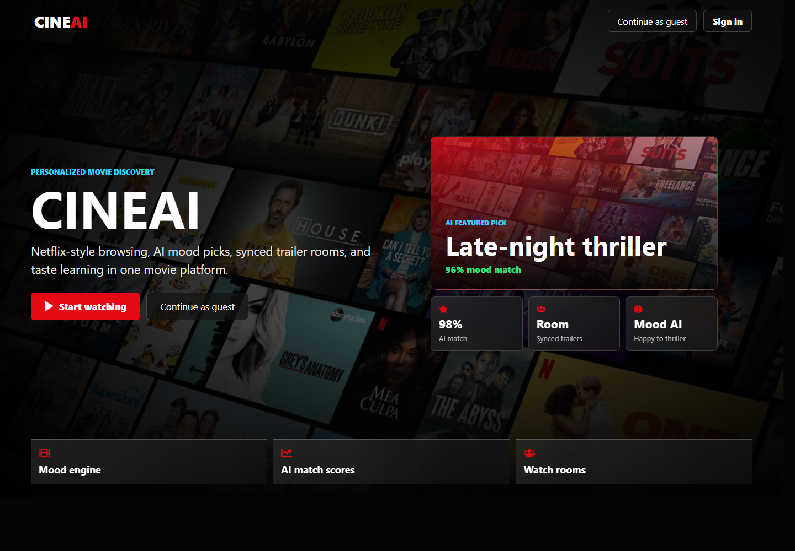
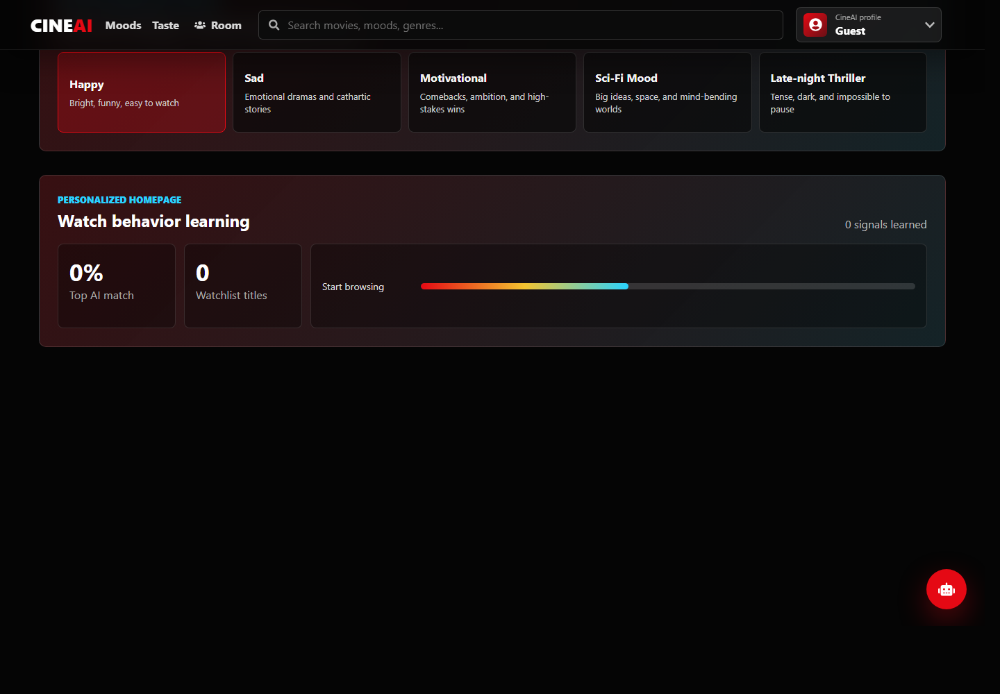
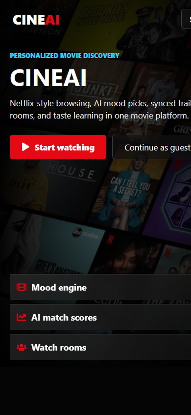

# CineAI

AI-powered personalized movie discovery platform using collaborative-style scoring, content-based filtering, mood recommendations, Firebase authentication, TMDB movie data, and realtime watch rooms.



## Overview

CineAI is a Netflix-style movie recommendation app built for personalized discovery. It learns from user searches, clicks, moods, watchlist activity, ratings, and reviews to surface better movie suggestions over time. The app also includes a shared watch-room experience where friends can join a room, search trailers, sync playback, and discuss picks in realtime.

## Screenshots

| Desktop landing | Personalized home |
| --- | --- |
|  |  |

| Mobile landing |
| --- |
|  |

## Highlights

- Netflix-style dark UI with cinematic hero sections and poster rails
- Firebase email/password signup, sign-in, Google auth, and guest mode
- TMDB-powered movie browsing, search, trailers, cast, and similar titles
- Mood Recommendation Engine for Happy, Sad, Motivational, Sci-Fi, and Late-night Thriller moods
- Personalized homepage with AI match scores and genre heatmaps
- Local taste learning from watch behavior, searches, ratings, reviews, and watchlist activity
- Groq-powered CineAI assistant for natural-language movie suggestions
- Discord-style watch rooms with room codes, synced trailer selection, online users, chat, and reactions
- Responsive layout for desktop and mobile screens

## Tech Stack

| Layer | Technology |
| --- | --- |
| Frontend | React 19, Vite, React Router |
| Styling | Custom CSS, responsive Netflix-style interface |
| Auth | Firebase Authentication |
| Realtime | Firebase Realtime Database |
| Movie API | TMDB API |
| AI Assistant | Groq SDK |
| Deployment | Vercel |

## Recommendation Approach

CineAI combines several recommendation signals:

- Content-based filtering from movie genres, ratings, popularity, and similarity
- Collaborative-style scoring inspired by repeated user behavior
- Mood-based discovery through curated TMDB discover queries
- Watch behavior learning through local search, click, watchlist, rating, and review history
- AI assistant prompts for conversational recommendations

## Getting Started

Install dependencies:

```bash
npm install
```

Create a local `.env` file:

```bash
VITE_TMDB_KEY=your_tmdb_api_key
VITE_GROQ_KEY=your_groq_api_key
```

Start the development server:

```bash
npm run dev
```

Build for production:

```bash
npm run build
```

Run lint checks:

```bash
npm run lint
```

## Project Structure

```text
src/
  api/          TMDB and Groq API helpers
  components/   Movie rows, movie modal, AI assistant, room modal
  pages/        Landing/auth, home, and watch-room screens
  styles/       Page-level responsive CSS
  utils/        Taste learning, watchlist, ratings, reviews
screenshots/    README screenshots
```

## Deployment

The project is configured for Vercel with `vercel.json`.

```bash
npm run build
npx vercel deploy --prod --yes
```

## Resume Positioning

**AI-powered personalized movie discovery platform using collaborative-style and content-based recommendation algorithms, Firebase authentication, TMDB integration, mood-based recommendations, and realtime social watch rooms.**

## Validation

- Production build passes with Vite
- ESLint passes
- Landing page and guest home flow verified locally
- Screenshots captured from the local Vite app
